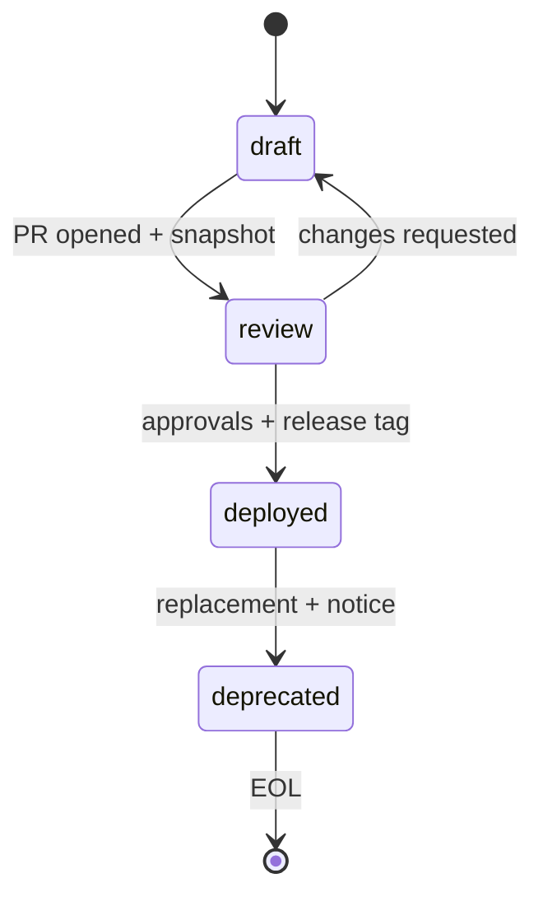

# Designing and Developing MCP Servers with a Cursor-Friendly Template and Scenario Playbook

## Executive summary

Model Context Protocol (MCP) is a JSON-RPC–based, stateful session protocol that standardizes how an MCP **host** (the AI application) connects to multiple MCP **servers** through isolated MCP **clients**, while preserving security boundaries between servers and keeping full conversation history in the host. citeturn20view0turn15view0 MCP servers expose three primary capability types—**tools**, **resources**, and **prompts**—which are negotiated at initialization and must be respected throughout a session. citeturn5view0turn20view0turn15view0

A practical, scalable way to build MCP servers for real-world engineering workflows is to treat each server like a “productized API surface with governance”: you define a stable **contract** (tool/resource/prompt schemas), pair it with explicit **security and privacy controls**, automate publishing and compatibility via **semantic versioning**, and wire in **observability** using both MCP-native primitives (structured logging, progress, tasks) and standard telemetry (OpenTelemetry/OTLP). citeturn25view1turn26view0turn11view0turn10view2turn9view0turn3search9turn3search1turn3search0turn18view0

This report provides:

- A concise, extensible **MCP template** (mcp.yaml + JSON Schema + server.json mapping) aligned to MCP spec requirements (capabilities, pagination, progress, tasks, logging, transports, authorization). citeturn25view1turn26view0turn19view0turn10view2turn9view0turn11view0turn7view0turn16view0  
- A **scenario playbook** (stdio vs Streamable HTTP, tools vs resources vs prompts, streaming/progress/tasks, auth patterns, multitenancy, and data classification) with cursor-friendly authoring and CI/CD steps. citeturn7view0turn25view1turn26view0turn10view2turn9view2turn16view0  
- Seven domain case studies (software development, software engineering, CAD, simulation, statistics/data science, ML development, autonomous AI/ML) including template-derived artifacts, contract snapshots, test/validation checklists, and deployment/rollback plans. (Domain-specific integration notes depend on your environment; this report flags those as assumptions.) citeturn20view0turn29view0  
- Recommended tooling and integrations: official SDKs, MCP Inspector, registry publishing automation, OpenTelemetry, SLSA provenance, SPDX SBOM. citeturn5view1turn5view2turn24view0turn3search9turn3search1turn3search14turn3search3turn3search19  

## Assumptions and unspecified constraints

MCP deliberately does **not** mandate a single UI/UX interaction model for tools, resources, or logging; implementations can present them however they choose. citeturn25view1turn26view0turn11view0 Because of this, many “real-world” design choices are host- and environment-dependent; this report makes assumptions explicit so you can adapt the template.

Key assumptions (you may need to override):

- **Host capabilities vary**: your host may support only a subset of MCP “current” protocol features, even though the current protocol revision is 2025-11-25. citeturn14view0turn15view0turn9view0  
- **Transport choice is contextual**: MCP defines stdio and Streamable HTTP; Streamable HTTP can optionally use Server-Sent Events (SSE) for streaming multiple server messages. citeturn7view0turn7view1  
- **Authorization expectations differ**: MCP authorization spec applies to HTTP-based transports; stdio servers should retrieve credentials from the environment instead of following the HTTP authorization flow. citeturn16view0turn7view0  
- **Long-running work support depends on protocol revision and client/server support**:  
  - Progress notifications are optional but standardized. citeturn10view0turn10view2  
  - Tasks are introduced in 2025-11-25 and are experimental; their behavior may evolve across protocol versions. citeturn9view0turn14view0  
- **Registry usage is optional**: The official MCP Registry is a centralized metadata repository for publicly accessible servers; it hosts metadata, not artifacts, and is currently in preview (breaking changes possible). citeturn29view0turn17view0  
- **Private vs public distribution**: the official registry does not support private servers; you may need a private registry for internal deployments. citeturn29view0  
- **Data classification and multitenancy are not standardized by MCP**: MCP requires access controls, URI validation, and security mitigations, but leaves your classification model (PII/regulated/secrets) and tenant isolation to your implementation. citeturn25view2turn26view3turn12view0turn9view2  

## Core developer loop for cursor-style incremental authoring

A cursor-friendly MCP development loop is most effective when you treat **the contract as the center of gravity**, then evolve it in small diffs that each compile, test, and validate:

1. **Declare intent + constraints**: choose transport(s), auth model, and data classification boundaries (even if provisional). citeturn7view0turn16view0turn12view0  
2. **Define the minimal contract**: start with 1–2 tools/resources/prompts and strict JSON Schemas; keep side effects small and observable. citeturn25view1turn26view0turn25view2  
3. **Implement server skeleton** using an official SDK; ensure correct lifecycle behavior (initialize → initialized) and capability declarations. citeturn5view0turn15view2turn5view1  
4. **Run smoke tests** via MCP Inspector and/or a simple client script; validate pagination, error handling, and content typing. citeturn5view2turn19view0turn25view2turn28view0  
5. **Add safety rails early**: input validation, access control, rate limits, URIs validation, log redaction, and human-in-the-loop guardrails surfaced in the host UI. citeturn25view1turn25view2turn26view3turn11view0turn12view0  
6. **Instrument**: MCP logging + progress notifications + task metadata (as needed), plus OpenTelemetry traces/metrics/logs exported via OTLP. citeturn11view0turn10view2turn9view2turn3search9turn3search1  
7. **Snapshot the contract**: export `tools/list`, `resources/list`, and `prompts/list` (respecting cursor-based pagination), commit the snapshot, and gate changes in CI. citeturn19view0turn25view1turn26view0turn8view3  
8. **Release and publish**: apply semantic versioning to your server releases; if using the registry, publish immutably with a unique version string and automate via GitHub Actions. citeturn3search0turn18view0turn18view1turn24view0  

This matches official guidance for “building with LLMs” as an iterative process: start with core functionality, then iterate and test each component thoroughly. citeturn21view0turn21view2  

## Scenario playbook for MCP design and deployment

MCP design can be framed as a decision matrix across transport, capability type, runtime behavior (sync/async), and security/auth posture.

### Scenario comparison table

| Scenario | Best-fit transport | Capability emphasis | Long-running pattern | Auth pattern | Typical risk level | Notes |
|---|---|---|---|---|---|---|
| Local workstation integration | stdio (recommended when possible) citeturn7view0 | tools + resources | progress notifications | env-based credentials (stdio) citeturn16view0 | medium | Must not write non-protocol content to stdout; log to stderr citeturn7view0turn5view0 |
| Remote service integration | Streamable HTTP (+ optional SSE) citeturn7view0turn7view1 | tools and/or resources | progress + tasks | OAuth-based (HTTP) citeturn16view0turn16view2 | high | Must validate Origin to prevent DNS rebinding; bind localhost when local; authenticate citeturn7view1 |
| Context catalog / browsing | any (often HTTP) | resources + templates | pagination + subscribe | OAuth when remote | medium | Resources support subscribe + listChanged; clients can subscribe to updates citeturn26view0 |
| Prompt library | any | prompts | N/A | minimal | low | Prompts are templates; still require governance and versioning citeturn8view3 |
| Large outputs / artifacts | any | tools returning resource_link or embedded resources | resource_link + pagination | depends | medium | Tools can return resource links and structuredContent; outputSchema enables validation citeturn25view2turn8view0 |
| Async orchestration | usually HTTP | tools + tasks | tasks (experimental) + progress | OAuth + task binding | high | Tasks have status, TTL, polling, and must be access-controlled/bound where possible citeturn9view0turn9view2turn10view2 |

### Cursor-style authoring and CI/CD by scenario

Below, each scenario is described as an incremental edit sequence (small diffs) plus the corresponding CI/CD gates.

**Stdio server scenario (local integration)**  
- Incremental authoring steps  
  - Add `spec.protocol.transports: [stdio]` and declare `tools`/`resources` capabilities. citeturn7view0turn25view2turn26view0  
  - Implement 1 tool with strict `inputSchema`; add outputSchema if you return structured output (`structuredContent`). citeturn25view2turn8view0  
  - Add resource templates if browsing files/objects by pattern; ensure URI validation. citeturn26view0turn26view3  
  - Add stderr logging only; never print to stdout (corrupts JSON-RPC). citeturn7view0turn5view0  
- CI/CD gates  
  - Unit tests: schema validation, permission checks, deterministic outputs  
  - Integration: run server as subprocess and call `tools/list`, `tools/call`, `resources/list`, `resources/read`  
  - Contract snapshot diff: fail if breaking without major version bump (SemVer) citeturn3search0  

**Streamable HTTP scenario (remote service)**  
- Incremental authoring steps  
  - Add `spec.protocol.transports: [streamable-http]` and specify the canonical endpoint (e.g., `/mcp`). citeturn7view0  
  - Implement Origin validation and local bind-to-loopback defaults to mitigate DNS rebinding. citeturn7view1  
  - Implement OAuth-based auth (Protected Resource Metadata discovery, Authorization Server Metadata, Resource Indicators). citeturn16view0turn16view2  
  - Add progress notifications for long calls; optionally adopt tasks if the client supports 2025-11-25 and you need “call-now/fetch-later.” citeturn10view2turn9view0  
- CI/CD gates  
  - Security tests: Origin rejection, auth-required on all routes, scope checks  
  - Protocol tests: server supports `Accept: application/json,text/event-stream` behaviors (JSON or SSE), returns 400 for invalid MCP-Protocol-Version header. citeturn7view1turn7view2  

**Tools-first vs resources-first vs prompts-first**  
- Tools-first: strongest for actions; must be human-in-the-loop and show tool invocation UX; servers must validate inputs, implement access control, rate limit, sanitize outputs. citeturn25view1turn25view2  
- Resources-first: strongest for contextual read-only access; servers must validate URIs; access controls for sensitive resources; support pagination for large catalogs. citeturn26view0turn26view3turn19view0  
- Prompts-first: strongest for templated workflows; still require versioning and review because prompts can change behavior materially. citeturn8view3turn3search0  

**Progress vs tasks**  
- Progress tokens must be unique across active requests; progress must monotonically increase; clients and servers should rate limit to avoid flooding. citeturn10view0turn10view2  
- Tasks are durable state machines for polling and deferred result retrieval; tasks include taskId, status, TTL, polling hints; messages related to tasks must include related-task metadata rules, and access control/binding is essential. citeturn9view0turn9view2  

**Multitenancy and data classification (cross-cutting)**  
MCP doesn’t define tenant isolation; you must implement it consistently across:  
- tool permission checks (per-user/per-tenant authorization) citeturn25view2  
- resource URI validation + per-tenant resource ACLs citeturn26view3  
- task binding so task IDs don’t become cross-tenant capability leaks citeturn9view2  
- logging that excludes credentials, PII, and internal system details. citeturn11view0  

A practical classification model (you should adapt to your org): `public`, `internal`, `confidential`, `restricted`, with tags like `pii`, `phi`, `export-controlled`, `secrets`. This report’s template supports this, but the taxonomy is not standardized by MCP.

## Template and governance artifacts

This section provides the reusable artifacts you asked for: **mcp.yaml**, a **server.json mapping snippet**, and a **JSON Schema** for the template, plus versioning/lifecycle rules, CI/CD guidance, and diagrams.

### Template field model and required/optional comparison

| Field | Required | Purpose | Notes / linkage to MCP |
|---|---:|---|---|
| `apiVersion`, `kind` | Yes | Template identification | Internal to your process |
| `metadata.name` | Yes | Stable server identity | Align with registry “name” if publishing citeturn29view0turn17view0 |
| `metadata.version` | Yes | Release version of the server contract | Use SemVer for predictability citeturn3search0turn18view0 |
| `spec.protocol.mcpRevisions` | Yes | Supported MCP protocol revisions | Negotiated during initialization; current is 2025-11-25 citeturn14view0turn15view2 |
| `spec.protocol.transports` | Yes | `stdio` and/or `streamable-http` | MCP defines both; Streamable HTTP supports SSE optional citeturn7view0turn7view1 |
| `spec.capabilities.tools/resources/prompts` | Yes (at least one) | Declared server capabilities | Tools/resources must declare capabilities and options (subscribe/listChanged) citeturn25view2turn26view0 |
| `spec.contract.tools[]` | Optional but recommended | Tool schemas + policies | Tools list supports pagination; outputSchema enables validation citeturn25view1turn25view2turn19view0 |
| `spec.contract.resources[]/templates[]` | Optional | Resource catalog design | Resource templates + annotations + URI schemes citeturn26view0turn26view1 |
| `spec.contract.prompts[]` | Optional | Prompt templates | Prompt listing and retrieval per spec citeturn8view3 |
| `spec.security` | Yes | Auth, secrets, consent, threat mitigations | Align with authorization spec + security best practices citeturn16view0turn12view0turn7view1 |
| `spec.observability` | Yes | Logging/progress/tasks/OTel | MCP logging must not include secrets/PII; progress/tasks standardized citeturn11view0turn10view2turn9view2turn3search9 |
| `spec.lifecycle.state` | Yes | Org lifecycle: draft→review→deploy→deprecate | Separate from MCP session lifecycle (init/operate/shutdown) citeturn15view0 |
| `spec.release` | Yes | Compatibility and migration rules | Registry versions immutable; no unpublish currently citeturn18view0turn18view1 |
| `spec.distribution.registry` | Optional | server.json integration | Registry hosts metadata only; preview citeturn29view0turn17view0 |

### mcp.yaml template

```yaml
apiVersion: mcp-template/v1
kind: MCPServer
metadata:
  name: com.example/mcp-server-name
  title: "Human friendly server name"
  description: "Concise description of what the server provides."
  owner:
    team: "team-name"
    contact: "email-or-slack-handle"
  version: "0.1.0"
  repository:
    url: "REPO_URL"
    vcs: "git"
  license: "Apache-2.0"
  tags:
    - "domain:software-dev"
    - "capability:tools"
spec:
  protocol:
    mcpRevisions:
      supported: ["2025-11-25"]
      preferred: "2025-11-25"
    transports:
      - type: "stdio"            # or "streamable-http"
        options:
          # stdio: process launched by host; logging must be stderr-only
          commandHint: "python server.py"
      # - type: "streamable-http"
      #   options:
      #     endpointPath: "/mcp"
      #     sse: "optional"
    pagination:
      enforcedForListOps: true
  capabilities:
    tools:
      enabled: true
      listChanged: false
    resources:
      enabled: false
      subscribe: false
      listChanged: false
    prompts:
      enabled: false
      listChanged: false
    logging:
      enabled: true
    progress:
      enabled: true
    tasks:
      enabled: false     # only if your server+clients support 2025-11-25 tasks
  contract:
    tools:
      - name: "example.tool"
        title: "Example Tool"
        description: "Does one small, testable task."
        inputSchema:
          type: object
          additionalProperties: false
          properties:
            input:
              type: string
          required: ["input"]
        outputSchema:
          type: object
          additionalProperties: false
          properties:
            output:
              type: string
          required: ["output"]
        policies:
          sideEffects: "none"   # none | read | write | destructive
          dataAccess:
            classifications: ["internal"]
          rateLimit:
            requestsPerMinute: 60
          humanInLoop:
            recommended: true
    resources:
      templates: []
      instances: []
    prompts: []
    contractSnapshot:
      enabled: true
      snapshotPath: "contracts/contract.snapshot.json"
  security:
    trustBoundary:
      isRemote: false
      multitenant: false
    auth:
      mode: "env"    # env (stdio) | oauth (http) | apiKey (http) | mTLS (http)
      oauth:
        enabled: false
        scopes: []
      secrets:
        sources:
          - "env"
        redaction:
          enabled: true
    privacy:
      logRedactionRequired: true
      piiInLogs: "forbidden"
      dataRetentionDays: 30
    threatMitigations:
      dnsRebinding:
        enabled: true
        validateOrigin: true
        bindLocalhostWhenLocal: true
      confusedDeputy:
        enabled: true
        perClientConsent: true
      tokenPassthrough:
        allowed: false
      ssrf:
        enabled: true
  observability:
    mcpLogging:
      enabled: true
      defaultLevel: "info"
      allowClientSetLevel: true
    otel:
      enabled: true
      exporter: "otlp"
      resourceAttributes:
        service.name: "com.example/mcp-server-name"
        service.version: "0.1.0"
    audit:
      enabled: true
      events:
        - "tools.call"
        - "resources.read"
        - "tasks.status"
  lifecycle:
    state: "draft"   # draft | review | deployed | deprecated
    reviewers:
      requiredApprovals: 2
  release:
    versioning:
      scheme: "semver"
      compatibilityRules:
        breakingChangeRequiresMajor: true
        additiveChangeRequiresMinor: true
        patchForBugfixOnly: true
    deprecation:
      policy:
        noticeDays: 90
        supportWindowDays: 180
    rollback:
      strategy: "revert-to-previous-version"
  distribution:
    registry:
      publishToOfficial: false
      serverJsonPath: "server.json"
      publisherMeta:
        enabled: true
        maxBytes: 4096
```

Template alignment notes: MCP supports cursor-based pagination for `tools/list`, `resources/list`, `prompts/list`, and related list operations; cursors must be treated as opaque and not persisted across sessions. citeturn19view0turn25view1turn26view0

### server.json snippet mapping

If you publish to the official registry, your `server.json` must include a unique immutable version; metadata changes are done by publishing a new version. citeturn18view0turn18view1 The registry stores metadata only (artifacts must be published to a package registry separately). citeturn17view0turn29view0

```json
{
  "$schema": "https://static.modelcontextprotocol.io/schemas/2025-12-11/server.schema.json",
  "name": "com.example/mcp-server-name",
  "description": "Concise description of what the server provides.",
  "repository": { "url": "REPO_URL", "source": "github" },
  "version": "0.1.0",
  "packages": [
    {
      "registryType": "pypi",
      "identifier": "mcp-server-name",
      "version": "0.1.0",
      "transport": { "type": "stdio" },
      "environmentVariables": [
        {
          "name": "API_TOKEN",
          "description": "Token for upstream API",
          "isRequired": true,
          "isSecret": true,
          "format": "string"
        }
      ]
    }
  ],
  "_meta": {
    "io.modelcontextprotocol.registry/publisher-provided": {
      "tool": "your-ci",
      "version": "1.0.0",
      "custom": { "contractSnapshotSha256": "..." }
    }
  }
}
```

Custom metadata under `_meta.io.modelcontextprotocol.registry/publisher-provided` is preserved, but the official registry enforces a 4KB limit for that extension area. citeturn18view1turn2search33

### JSON Schema for mcp.yaml

```json
{
  "$schema": "https://json-schema.org/draft/2020-12/schema",
  "$id": "https://example.com/schemas/mcp-template.schema.json",
  "title": "MCP Server Template",
  "type": "object",
  "required": ["apiVersion", "kind", "metadata", "spec"],
  "properties": {
    "apiVersion": { "type": "string", "const": "mcp-template/v1" },
    "kind": { "type": "string", "const": "MCPServer" },
    "metadata": {
      "type": "object",
      "required": ["name", "version"],
      "properties": {
        "name": { "type": "string", "minLength": 1 },
        "version": { "type": "string", "minLength": 1 },
        "title": { "type": "string" },
        "description": { "type": "string" }
      },
      "additionalProperties": true
    },
    "spec": {
      "type": "object",
      "required": ["protocol", "capabilities", "security", "observability", "lifecycle", "release"],
      "properties": {
        "protocol": {
          "type": "object",
          "required": ["mcpRevisions", "transports"],
          "properties": {
            "mcpRevisions": {
              "type": "object",
              "required": ["supported", "preferred"],
              "properties": {
                "supported": { "type": "array", "items": { "type": "string" }, "minItems": 1 },
                "preferred": { "type": "string" }
              }
            },
            "transports": {
              "type": "array",
              "minItems": 1,
              "items": {
                "type": "object",
                "required": ["type"],
                "properties": {
                  "type": { "type": "string", "enum": ["stdio", "streamable-http"] },
                  "options": { "type": "object" }
                },
                "additionalProperties": false
              }
            }
          }
        },
        "capabilities": {
          "type": "object",
          "properties": {
            "tools": { "type": "object" },
            "resources": { "type": "object" },
            "prompts": { "type": "object" },
            "logging": { "type": "object" },
            "progress": { "type": "object" },
            "tasks": { "type": "object" }
          },
          "additionalProperties": false
        }
      },
      "additionalProperties": true
    }
  }
}
```

### Lifecycle states table and diagrams

This template defines an **organizational lifecycle** distinct from the MCP **session lifecycle** (initialization → operation → shutdown). citeturn15view0

| Org state | Entry criteria | Allowed changes | Required checks | Exit criteria |
|---|---|---|---|---|
| draft | template exists; minimal contract | breaking allowed | lint + unit tests | ready for security review |
| review | threat model + auth selected | limited; breaking strongly discouraged | contract snapshot + inspector tests + security checklist | approvals satisfied |
| deployed | released artifact + monitored | additive changes via minor; patches for bugfix | CI green + provenance + SBOM | replaced or deprecated |
| deprecated | replacement exists + notice period | no new features | marker + docs + migration guide | end-of-life reached |

Mermaid diagram: organizational lifecycle



Mermaid diagram: deployment flow (package + registry)

```mermaid
flowchart TD
  A[Commit] --> B[CI: lint + unit tests]
  B --> C[Integration: Inspector + protocol checks]
  C --> D[Build artifact: pkg/container]
  D --> E[Generate SBOM + provenance]
  E --> F[Tag release (SemVer)]
  F --> G[Publish artifact to package registry]
  G --> H[Publish server.json metadata (immutable)]
  H --> I[Smoke test in target host]
  I --> J[Monitor + rollback-ready]
```

Registry and release constraints:  
- Registry versions are immutable; you update metadata by submitting a new `server.json` with a new unique version string. citeturn18view0turn18view1turn17view0  
- Unpublishing is currently not supported in the official registry, so rollback is normally “publish a newer version that points back to a stable artifact,” or “ship a fixed patch version.” citeturn18view1turn3search0  

Supply-chain artifacts:  
- SLSA defines levels and provenance expectations for build integrity, and provides provenance guidance. citeturn3search14turn3search2turn3search6  
- SPDX is an ISO/IEC SBOM standard (ISO/IEC 5962:2021) with current spec versions available. citeturn3search3turn3search19turn3search11  

Observability baseline: OpenTelemetry is a framework/toolkit for generating, exporting, and collecting telemetry (traces/metrics/logs), and OTLP is a stable telemetry delivery protocol for those signals. citeturn3search9turn3search1turn3search5  

## Domain case studies with template-derived artifacts

These are practical “case studies” modeled as deployable patterns. Where a scenario depends on your platform (specific CAD tool APIs, HPC schedulers, internal IAM), this report notes assumptions explicitly. For each case study, “recommended transport/auth” is based on MCP’s transport + authorization requirements and typical threat surfaces. citeturn7view0turn16view0turn12view0

### Software development case study: repo assistant and CI tools

**What it does**  
- Local repo exploration (resources): file tree, key docs, dependency graph  
- Tools: `repo.search`, `repo.diff_apply`, `ci.trigger`, `ci.status`  
- Optional prompts: “Create a PR plan,” “Explain build failure”

This aligns with official reference servers like Filesystem and Git, which demonstrate secure file ops and Git repo tooling patterns. citeturn30view0turn31view0

**Recommended transport / auth / risk**  
- Transport: stdio for local repo actions; Streamable HTTP for CI orchestration if CI is remote. citeturn7view0  
- Auth: env-based tokens for stdio; OAuth for remote if used. citeturn16view0  
- Risk: high (write actions + credentials). Tools should be human-in-the-loop and inputs visible. citeturn25view1turn25view2  

**Template-derived mcp.yaml (delta)**

```yaml
metadata:
  name: com.example/repo-ci-mcp
  version: "1.0.0"
spec:
  protocol:
    transports:
      - type: "stdio"
  capabilities:
    tools: { enabled: true, listChanged: true }
    resources: { enabled: true, subscribe: true, listChanged: true }
    prompts: { enabled: true, listChanged: false }
    tasks: { enabled: false }
  contract:
    tools:
      - name: "repo.search"
        inputSchema:
          type: object
          additionalProperties: false
          properties:
            query: { type: string }
            path_glob: { type: string }
          required: ["query"]
        outputSchema:
          type: object
          additionalProperties: false
          properties:
            matches:
              type: array
              items:
                type: object
                properties:
                  path: { type: string }
                  line: { type: integer }
                  snippet: { type: string }
                required: ["path", "line", "snippet"]
          required: ["matches"]
        policies:
          sideEffects: "read"
          humanInLoop: { recommended: false }
      - name: "repo.diff_apply"
        inputSchema:
          type: object
          additionalProperties: false
          properties:
            unified_diff: { type: string }
            dry_run: { type: boolean, default: true }
          required: ["unified_diff"]
        policies:
          sideEffects: "write"
          humanInLoop: { recommended: true }
```

**Contract snapshot (example excerpt)**  
This is a “frozen view” of what `tools/list` returns (store it after following cursor-pagination rules). citeturn25view1turn19view0

```json
{
  "mcpRevision": "2025-11-25",
  "tools": ["repo.search", "repo.diff_apply", "ci.trigger", "ci.status"],
  "resources": ["file:///", "git://repo/status"],
  "prompts": ["repo.plan_pr", "repo.explain_failure"]
}
```

**CI/CD pipeline (key steps)**  
- Run unit tests, then run inspector-based integration tests (local)  
- Fail CI if contract snapshot changes without appropriate version bump (SemVer logic) citeturn3search0  
- If publishing publicly: tag release and publish server.json immutably citeturn24view0turn18view0  

**Validation checklist (reviewer + automated)**  
- Tool schemas: `additionalProperties: false` on write tools; inputs validated; errors returned without leaking secrets. citeturn25view2  
- Human-in-loop: write/destructive tools flagged so host can prompt confirmation. citeturn25view1  
- Resources: URIs validated; access controls enforced; subscription notifications correct. citeturn26view0turn26view3  
- Logging: no secrets/PII/internal system details. citeturn11view0  
- Pagination: list ops support cursors; clients treat cursors as opaque (in tests). citeturn19view0  

**Deployment & rollback**  
- Deploy: ship as local package (e.g., PyPI/NPM) and configure host to launch via stdio. citeturn7view0turn30view0  
- Rollback: reinstall older package version; optionally publish new server version that points to that artifact (registry versions immutable). citeturn18view0turn18view1  

**Runnable micro-examples (Python SDK)**  
(Uses FastMCP; direct execution is supported; Streamable HTTP is available as transport option.) citeturn27view1turn23view2  

```python
# server_repo_ci.py
from mcp.server.fastmcp import FastMCP

mcp = FastMCP("Repo+CI MCP")

@mcp.tool()
def repo_search(query: str, path_glob: str = "**/*") -> dict:
    return {"matches": [{"path": "README.md", "line": 1, "snippet": "Example"}]}

def main():
    mcp.run()  # stdio by default

if __name__ == "__main__":
    main()
```

```python
# smoke_repo_ci.py
import asyncio
from mcp import ClientSession, StdioServerParameters
from mcp.client.stdio import stdio_client

async def main():
    params = StdioServerParameters(command="python", args=["server_repo_ci.py"])
    async with stdio_client(params) as (r, w):
        async with ClientSession(r, w) as session:
            await session.initialize()
            tools = await session.list_tools()
            print([t.name for t in tools.tools])
            res = await session.call_tool("repo_search", arguments={"query": "Example"})
            print(res.structuredContent or res.content[0])

if __name__ == "__main__":
    asyncio.run(main())
```

```bash
# Inspector (stdio)
npx -y @modelcontextprotocol/inspector python server_repo_ci.py
```

MCP Inspector usage via `npx` is documented as a standard testing workflow. citeturn5view2turn4search1  

### Software engineering case study: code review automation and infrastructure-as-code

**What it does**  
- Tools for PR review: `review.summarize_changes`, `review.risk_flags`  
- IaC tools: `iac.plan`, `iac.apply` (with strict gating), `iac.diff`  
- Resources: policy docs, runbook excerpts, current infra state snapshots

**Recommended transport / auth / risk**  
- Transport: Streamable HTTP when tools operate in shared infra environments; stdio if strictly local and sandboxed. citeturn7view0  
- Auth: OAuth for HTTP-based; least privilege and step-up flows for destructive ops. citeturn16view0turn12view0  
- Risk: very high (infra changes). Must require explicit user confirmation and strict input validation. citeturn25view1turn25view2  

**Template-derived tools (examples)**  
- `iac.plan` (sideEffects: read)  
- `iac.apply` (sideEffects: destructive)  
- `review.risk_flags` returns structuredContent with outputSchema to enable deterministic gating. citeturn8view0turn25view2  

**Threat mitigations (must-have)**  
- Token passthrough forbidden; avoid passing client tokens to downstream systems without proper audience binding. citeturn12view0  
- Confused deputy: implement per-client consent when acting as an OAuth proxy. citeturn12view0turn16view0  
- Logs must not include credentials/PII/internal system details. citeturn11view0  

**Runnable micro-examples (focus: structured output for gating)**

```python
# server_iac_review.py
from mcp.server.fastmcp import FastMCP

mcp = FastMCP("IaC+Review MCP")

@mcp.tool()
def review_risk_flags(diff_summary: str) -> dict:
    # structured output (client can validate against outputSchema in contract)
    return {"risk": "high", "reasons": ["touches prod networking"], "requiresApproval": True}

def main():
    mcp.run()

if __name__ == "__main__":
    main()
```

```python
# smoke_iac_review.py
import asyncio
from mcp import ClientSession, StdioServerParameters
from mcp.client.stdio import stdio_client

async def main():
    params = StdioServerParameters(command="python", args=["server_iac_review.py"])
    async with stdio_client(params) as (r, w):
        async with ClientSession(r, w) as session:
            await session.initialize()
            res = await session.call_tool("review_risk_flags", arguments={"diff_summary": "..."})
            print(res.structuredContent)

if __name__ == "__main__":
    asyncio.run(main())
```

```bash
npx -y @modelcontextprotocol/inspector python server_iac_review.py
```

### CAD design case study: model conversion and parametric tooling

**What it does**  
- Tools: `cad.convert_model`, `cad.extract_bom`, `cad.apply_parameters`  
- Resources: part libraries, parameter dictionaries, design rules docs  
- Long-running conversions should emit progress notifications; large outputs should be referenced as resources (resource_link) rather than dumped inline.

**Recommended transport / auth / risk**  
- Transport: stdio (CAD often runs on a workstation with local artifacts); Streamable HTTP if conversion happens in a shared service. citeturn7view0  
- Auth: env-based for local; OAuth if remote. citeturn16view0  
- Risk: medium-high (IP exposure, large binaries).

**Progress requirements**  
Progress tokens must be unique for active requests and progress values must increase; include a human-readable `message` field (2025-11-25 progress). citeturn10view2turn10view0  

**Runnable micro-examples (progress-style)**

```python
# server_cad.py
from mcp.server.fastmcp import Context, FastMCP
from mcp.server.session import ServerSession

mcp = FastMCP("CAD MCP")

@mcp.tool()
async def cad_convert_model(src_uri: str, dst_format: str, ctx: Context[ServerSession, None]) -> dict:
    await ctx.info("Starting conversion")
    # In real life: emit progress notifications via ctx (implementation-specific in SDK patterns)
    return {"result_uri": f"file:///converted/model.{dst_format}"}

def main():
    mcp.run()

if __name__ == "__main__":
    main()
```

```python
# smoke_cad.py
import asyncio
from mcp import ClientSession, StdioServerParameters
from mcp.client.stdio import stdio_client

async def main():
    params = StdioServerParameters(command="python", args=["server_cad.py"])
    async with stdio_client(params) as (r, w):
        async with ClientSession(r, w) as session:
            await session.initialize()
            res = await session.call_tool("cad_convert_model", arguments={"src_uri": "file:///in.step", "dst_format": "stl"})
            print(res.structuredContent or res.content[0])

if __name__ == "__main__":
    asyncio.run(main())
```

```bash
npx -y @modelcontextprotocol/inspector python server_cad.py
```

### Simulation case study: physics simulation orchestration

**What it does**  
- Tools: `sim.submit`, `sim.status`, `sim.fetch_results`  
- Uses tasks (if supported) to sustain long-running compute and deferred results; otherwise uses progress + polling tools.

**Recommended transport / auth / risk**  
- Transport: Streamable HTTP for distributed orchestration; tasks are designed for polling and deferred retrieval. citeturn7view0turn9view0  
- Auth: OAuth; task IDs must be bound to authorization context when provided. citeturn16view0turn9view2  
- Risk: high (compute resource abuse, data leakage).

**Tasks behavior you must design around**  
- Tasks are experimental and may evolve; treat as “opt-in capability” and require feature detection via initialization. citeturn9view0turn15view0  
- Tasks can be listed with cursor-based pagination, include TTL and polling hints, and access control is critical. citeturn9view2turn19view0  

**Runnable micro-examples (Streamable HTTP transport option)**  
(Using FastMCP transport selection; Streamable HTTP is the recommended production transport in the Python SDK notes.) citeturn27view1turn7view0  

```python
# server_sim_http.py
from mcp.server.fastmcp import FastMCP

mcp = FastMCP("Sim Orchestrator", stateless_http=True, json_response=True)

@mcp.tool()
def sim_submit(model: str, steps: int = 1000) -> dict:
    # In real life: return a task handle or job id + resource_link to logs
    return {"jobId": "job-123", "status": "queued"}

if __name__ == "__main__":
    mcp.run(transport="streamable-http")
```

```python
# smoke_sim_http.py
import asyncio
from mcp import ClientSession
from mcp.client.streamable_http import streamable_http_client

async def main():
    async with streamable_http_client("http://localhost:8000/mcp") as (r, w, _):
        async with ClientSession(r, w) as session:
            await session.initialize()
            res = await session.call_tool("sim_submit", arguments={"model": "pendulum"})
            print(res.structuredContent or res.content[0])

if __name__ == "__main__":
    asyncio.run(main())
```

```bash
# Run server (example)
python server_sim_http.py
# Then inspect (examples depend on how your inspector is configured for HTTP)
npx -y @modelcontextprotocol/inspector python server_sim_http.py
```

### Statistics and data science case study: analysis tools and notebooks integration

**What it does**  
- Resources: dataset schemas, notebook snapshots, feature definitions  
- Tools: `stats.fit`, `stats.test`, `stats.plot` (often returning images or resource links)  
- Emphasize reproducibility and structured outputs.

**Recommended transport / auth / risk**  
- Transport: stdio for local notebook; HTTP for shared service. citeturn7view0  
- Auth: env tokens locally; OAuth remotely. citeturn16view0  
- Risk: medium (PII exposure possible). Logging must not include PII. citeturn11view0  

**Structured outputs**  
Tools can return structuredContent; if outputSchema is provided, servers must conform and clients should validate. citeturn8view0turn25view2  

**Runnable micro-examples**

```python
# server_stats.py
from mcp.server.fastmcp import FastMCP

mcp = FastMCP("Stats MCP")

@mcp.tool()
def stats_test(test: str, p_value: float) -> dict:
    return {"test": test, "pValue": p_value, "rejectNull": p_value < 0.05}

def main():
    mcp.run()

if __name__ == "__main__":
    main()
```

```python
# smoke_stats.py
import asyncio
from mcp import ClientSession, StdioServerParameters
from mcp.client.stdio import stdio_client

async def main():
    params = StdioServerParameters(command="python", args=["server_stats.py"])
    async with stdio_client(params) as (r, w):
        async with ClientSession(r, w) as session:
            await session.initialize()
            res = await session.call_tool("stats_test", arguments={"test": "t-test", "p_value": 0.03})
            print(res.structuredContent)

if __name__ == "__main__":
    asyncio.run(main())
```

```bash
npx -y @modelcontextprotocol/inspector python server_stats.py
```

### ML model development case study: training orchestration and RAG components

**What it does**  
- Training tools: `train.submit`, `train.metrics`, `train.artifacts`  
- RAG tools/resources: `rag.index`, `rag.query`, resources for corpora metadata  
- Uses progress and tasks for training jobs; uses resources or resource links for model artifacts, evaluation reports, and large logs.

**Recommended transport / auth / risk**  
- Transport: Streamable HTTP for shared training clusters; tasks recommended if supported. citeturn7view0turn9view0  
- Auth: OAuth; scope minimization and step-up for destructive operations (e.g., delete models). citeturn16view0turn12view0  
- Risk: high (data leakage, compute abuse).

**Resource links and embedded resources**  
Tools may return resource links and embedded resources. Large outputs should prefer resource_link patterns; structured outputs should be validated via outputSchema. citeturn25view2turn8view0  

**Runnable micro-examples**

```python
# server_ml.py
from mcp.server.fastmcp import FastMCP

mcp = FastMCP("ML MCP")

@mcp.tool()
def rag_query(query: str, top_k: int = 5) -> dict:
    return {"hits": [{"docId": "d1", "score": 0.91, "snippet": "..." }][:top_k]}

if __name__ == "__main__":
    mcp.run()
```

```python
# smoke_ml.py
import asyncio
from mcp import ClientSession, StdioServerParameters
from mcp.client.stdio import stdio_client

async def main():
    params = StdioServerParameters(command="python", args=["server_ml.py"])
    async with stdio_client(params) as (r, w):
        async with ClientSession(r, w) as session:
            await session.initialize()
            res = await session.call_tool("rag_query", arguments={"query": "What is MCP?"})
            print(res.structuredContent)

if __name__ == "__main__":
    asyncio.run(main())
```

```bash
npx -y @modelcontextprotocol/inspector python server_ml.py
```

### Autonomous AI/ML development case study: agentic orchestration with safety controls

**What it does**  
- Tools for planning/execution: `agent.plan`, `agent.execute_step`, `agent.cancel`  
- Strong governance around escalation, approvals, and audit logs  
- Uses tasks to allow “execute step” asynchronously and safely with polling and cancellation.

**Recommended transport / auth / risk**  
- Transport: Streamable HTTP + SSE if you need streaming notifications; tasks are appropriate for durable execution state. citeturn7view1turn9view0  
- Auth: OAuth; per-client consent if proxying to third-party APIs; avoid token passthrough. citeturn12view0turn16view0  
- Risk: maximum (privileged automation). Enforce human-in-loop confirmations and strong audit trails. citeturn25view1turn11view0turn9view2  

**Threat model alignment (minimum bar)**  
- Confused deputy mitigations: per-client consent, CSRF protections, redirect URI exact match, secure cookies if used. citeturn12view0  
- Tool invocation safeguards: show tool inputs, confirm sensitive operations, validate outputs before passing to model. citeturn25view2  
- Task isolation: bind tasks to authorization context when provided; do not let taskId become a bearer capability without access checks. citeturn9view2  

**Runnable micro-examples (pattern-only)**  
(Full agentic safety needs host-level policy; MCP provides the primitives and security guidance but does not enforce your business policy.) citeturn20view0turn25view1turn12view0  

```python
# server_agent.py
from mcp.server.fastmcp import FastMCP

mcp = FastMCP("Agent MCP")

@mcp.tool()
def agent_plan(goal: str) -> dict:
    return {"steps": [{"id": "s1", "action": "analyze"}, {"id": "s2", "action": "execute"}]}

if __name__ == "__main__":
    mcp.run()
```

```python
# smoke_agent.py
import asyncio
from mcp import ClientSession, StdioServerParameters
from mcp.client.stdio import stdio_client

async def main():
    params = StdioServerParameters(command="python", args=["server_agent.py"])
    async with stdio_client(params) as (r, w):
        async with ClientSession(r, w) as session:
            await session.initialize()
            res = await session.call_tool("agent_plan", arguments={"goal": "deploy safely"})
            print(res.structuredContent)

if __name__ == "__main__":
    asyncio.run(main())
```

```bash
npx -y @modelcontextprotocol/inspector python server_agent.py
```

## Tooling, automation, and reviewer checklists

### Recommended tooling and integrations

**Official SDKs and development workflow**  
Official SDKs support creating servers exposing tools/resources/prompts and clients to connect to any MCP server, with local and remote transports and protocol compliance. citeturn5view1turn4search4  
- The official build-server tutorial emphasizes tool/resource/prompt concepts and warns about stdout logging for stdio servers. citeturn5view0  
- The Python SDK provides FastMCP patterns for tools/resources, direct execution, and Streamable HTTP transport configuration. citeturn23view2turn27view1  
- The TypeScript SDK repository documents packaging and runnable examples; note that v2 is in development and v1.x remains recommended for production until v2 stabilizes. citeturn22view0  

**Testing and debugging**  
- MCP Inspector is the interactive testing/debugging tool; it runs via `npx` and supports testing servers (including those launched from npm/PyPI). citeturn5view2turn4search1  

**Registry publishing automation**  
- The official registry quickstart shows using `mcp-publisher init` to generate server.json and publishing a package first because the registry hosts metadata only. citeturn17view0turn29view0  
- GitHub Actions automation is documented, with OIDC auth recommended and a tag-based release flow. citeturn24view0  
- Registry publishing is immutable per version; custom publisher metadata is allowed under `_meta` with a 4KB limit. citeturn18view1turn18view0  

**Observability and telemetry**  
- Use MCP logging (clients can set minimum log level; logs must exclude credentials/PII/internal system details). citeturn11view0  
- Use OpenTelemetry for unified traces/metrics/logs and export via OTLP. citeturn3search9turn3search1turn3search5  

**Supply chain**  
- Generate provenance aligned to SLSA and produce SBOMs aligned to SPDX; this supports integrity, reproducibility, and auditability. citeturn3search14turn3search2turn3search3turn3search19  

### Master reviewer/validator checklist

This checklist can be applied globally, then extended per case study.

- **Protocol correctness**  
  - Initialization: client sends `initialize`, server responds, client sends `notifications/initialized`; server avoids sending non-ping/logging requests before initialized. citeturn15view2  
  - Version negotiation: supports at least one shared revision; disconnects cleanly on mismatch. citeturn15view2turn14view0  
  - Capabilities: declared accurately and enforced (tools/resources/prompts/logging/progress/tasks). citeturn20view0turn25view2turn26view0turn11view0turn9view0  
  - Pagination: list operations implement cursors correctly; cursors treated as opaque. citeturn19view0  

- **Transport correctness**  
  - stdio: no non-protocol stdout writes; newline-delimited JSON-RPC; stderr allowed for logs. citeturn7view0turn5view0  
  - Streamable HTTP: supports POST/GET to a single MCP endpoint; handles JSON and SSE response modes; enforces MCP-Protocol-Version header behavior; validates Origin to prevent DNS rebinding. citeturn7view1turn7view2  

- **Authorization and security**  
  - HTTP auth: aligns with MCP authorization spec requirements (OAuth 2.1 basis, metadata discovery, resource indicators). citeturn16view0turn16view2  
  - Confused deputy mitigations if acting as OAuth proxy: per-client consent, CSRF protections, redirect URI exact match, secure cookie practices. citeturn12view0  
  - Token passthrough: forbidden; do not accept arbitrary client tokens for downstream calls without proper validation/audience binding. citeturn12view0  
  - Input validation, access controls, rate limits for tools; URI validation and permission checks for resources. citeturn25view2turn26view3  
  - Logging redaction: no credentials/PII/internal system details. citeturn11view0  

- **Operational readiness**  
  - Progress: if used, tokens unique, progress monotonic, rate limited, stops after completion; task progress continues across task lifetime. citeturn10view0turn10view2  
  - Tasks: if used, treat as experimental; enforce task access control; bind tasks to authorization context where possible; honor TTL and polling guidance. citeturn9view0turn9view2  
  - Observability: OTLP exporter configured; audit events emitted for tool calls/resource reads/task status; logging level configurable. citeturn11view0turn3search1turn3search9  

- **Release and compatibility**  
  - Versioning: SemVer applied to server releases; contract-breaking changes trigger major version bumps. citeturn3search0  
  - Registry (if used): version strings unique and immutable; publish via new versions; no unpublish; `_meta` within 4KB. citeturn18view0turn18view1  

- **Automation**  
  - CI includes inspector-based integration tests and contract snapshot diffs  
  - Publishing automation uses tag-based triggers and recommended OIDC patterns (if on GitHub Actions). citeturn24view0  

This end-to-end approach is consistent with MCP’s architectural intent: hosts coordinate orchestration and enforce policy/consent, servers stay focused and composable, and features evolve progressively via negotiated capabilities. citeturn20view0turn25view1turn15view0