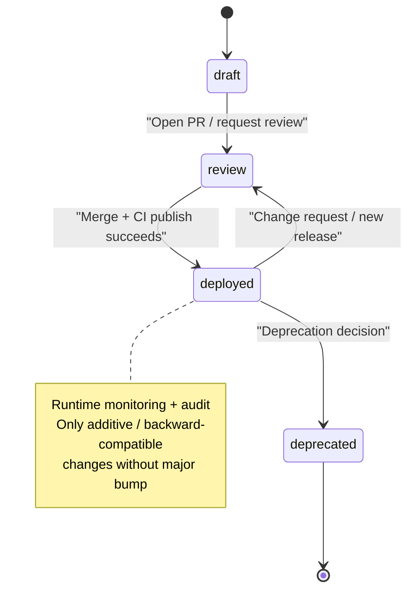
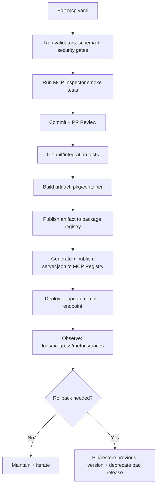

# Model Context Protocol Template for Cursor-Style AI Development Workflows

## Executive summary

This report proposes a **practical, extensible “MCP server template”** that functions as a *single source of truth* for specifying, reviewing, deploying, and operating new Model Context Protocol (MCP) servers in **AI-driven development workflows that rely on incremental, cursor-style edits**. It is designed to complement (not replace) the MCP wire protocol: MCP standardizes the **host–client–server** architecture and the on-wire primitives (**tools, resources, prompts**) plus lifecycle/version negotiation; the template standardizes *your engineering workflow* around those protocol concepts. citeturn8view5turn4view7turn8view6turn4view0turn16view0

Key design decisions:

- **Two version planes** are always explicit:  
  (a) **MCP protocol revision** (date-based `YYYY-MM-DD` negotiated at initialization), and  
  (b) **server release version** (recommended SemVer) used for distribution, CI/CD, and rollback. citeturn16view0turn4view2turn16view2turn17search0
- **Security and privacy are treated as first-class metadata**, reflecting MCP’s architectural model where the *host* enforces consent and isolation and servers should receive only the context they need. citeturn8view5turn8view7turn6view2
- **Deployment is transport-agnostic**, covering both **stdio** (local subprocess) and **Streamable HTTP** (remote). Stdio credentialing uses environment-based approaches; Streamable HTTP aligns with MCP’s OAuth-based authorization spec when protection is needed. citeturn4view3turn8view3turn6view0turn6view3
- **Cursor-style incremental editing is optimized** by: (1) a compact YAML canonical format, (2) deterministic validation gates, (3) small “patch-sized” review units, and (4) generated artifacts (like registry `server.json`) rather than hand-edited duplicates. citeturn9view0turn21view1turn16view2

Unspecified constraints (explicitly assumed unknown): host application UX, secrets manager, container/orchestrator choice, enterprise IdP, runtime language, and network environment. MCP intentionally does not mandate a single UI/interaction model for tools/resources/logging; therefore the template includes extension points (`x-*`) for host/platform specifics. citeturn8view0turn8view7turn11view0turn16view0

## Protocol foundations that shape a good template

### Architecture boundaries that must be captured as metadata

MCP follows a **host → client → server** architecture: the host manages multiple clients and is responsible for permissioning, lifecycle, and user authorization decisions. Servers provide focused capabilities and should not “see into” other servers or the full conversation; the host enforces these boundaries. citeturn8view5turn4view7

A workflow template should therefore record:

- **What primitives you expose** (tools/resources/prompts) and their risk level. citeturn8view6  
- **What consent/approval model you expect** for high-impact tools (human-in-the-loop guidance is explicitly recommended for tool invocation). citeturn8view7  
- **What data handling constraints apply** (PII, secrets, tenant isolation), because logs and tool outputs can leak sensitive material if unmanaged. citeturn11view0turn6view2  

### Lifecycle and version negotiation that affect deployment and compatibility

MCP requires a rigorous connection lifecycle:

- **Initialization must be first**, with the client sending `initialize` including the `protocolVersion` requested, client capabilities, and client info; server responds with its selected protocol version and its capabilities; client then sends `notifications/initialized`. citeturn4view1turn4view2  
- **Version negotiation rule**: if the server supports the requested version it must respond with the same; otherwise it responds with another supported version; if client can’t support that, it should disconnect. citeturn4view2turn16view0  
- MCP protocol versions are **date-based (`YYYY-MM-DD`)** and only change when backward-incompatible changes are introduced, with revisions marked draft/current/final. citeturn16view0  

Your template must therefore define:

- **Supported MCP protocol revisions** (for interoperability)  
- **Compatibility expectations** by transport (especially HTTP headers and session IDs) citeturn8view3turn4view2  

### Transport implications for CI/CD and ops

MCP defines two standard transports:

- **stdio**: client launches server as subprocess; newline-delimited JSON-RPC messages; server must not write non-protocol data to stdout; stderr may be used for logging. citeturn4view3  
- **Streamable HTTP**: for HTTP use, clients must include `MCP-Protocol-Version` headers on subsequent requests; servers have specified backwards-compatibility behaviors and error handling (e.g., missing header fallback, invalid header → `400`). citeturn8view3turn8view4  

Because transport selection changes auth patterns, observability, and deployment shape, your template should encode transport explicitly (not as an afterthought). citeturn4view3turn8view3

## MCP template optimized for incremental authoring and deployment

### Required vs optional metadata fields

The table below lists a **recommended core field set**. “Required” here means: without it, reviewers and automated validators cannot reliably decide whether the MCP server is safe to deploy.

| Field path | Required | What it controls | Notes / mapping |
|---|---:|---|---|
| `apiVersion`, `kind` | Yes | Template schema identity | Use your org namespace; not part of MCP wire protocol. |
| `metadata.name` | Yes | Human-friendly internal name | Keep stable for repo references. |
| `spec.identity.mcpName` | Yes | Public/server canonical name | Matches registry naming patterns; aligns with registry `name`. citeturn6view4turn9view0 |
| `spec.identity.title`, `description` | Yes | UX + discoverability | Maps to registry `title`/`description`. citeturn16view2turn9view0 |
| `spec.identity.version` | Yes | Release version | Registry requires unique immutable versions; SemVer recommended. citeturn16view2turn17search0 |
| `spec.protocol.preferredVersion` | Yes | MCP protocol revision | Date version string; negotiated during `initialize`. citeturn4view1turn16view0 |
| `spec.protocol.supportedVersions` | Yes | Backward compatibility | Explicitly list tested revisions. citeturn16view0turn4view2 |
| `spec.protocol.transports[]` | Yes | stdio vs HTTP deployment | MCP defines both; behavior differs. citeturn4view3turn8view3 |
| `spec.surface.capabilities` | Yes | Declared primitives/features | Capabilities negotiate what can be used. citeturn4view1turn6view7 |
| `spec.security.auth.mode` | Yes | Auth strategy | Stdio creds via env; HTTP can use OAuth-based flow. citeturn6view0turn6view3 |
| `spec.security.dataHandling` | Yes | Privacy & retention | Ensure logs don’t leak secrets/PII. citeturn11view0 |
| `spec.lifecycle.state` | Yes | Draft → review → deployed → deprecated | Align with registry `status` semantics where applicable. citeturn16view5 |
| `spec.observability.logging` | Recommended | MCP logging behavior | MCP defines `logging/setLevel` + `notifications/message`. citeturn11view0 |
| `spec.observability.progress` | Recommended | Long-running UX | `_meta.progressToken` + `notifications/progress`. citeturn11view2turn10search1 |
| `spec.observability.tracing` | Optional | Distributed tracing | Recommend OpenTelemetry for vendor-neutral telemetry. citeturn17search9turn17search1 |
| `spec.deployment.registry.serverJson` | Recommended | Publishable metadata | Registry expects `server.json`; metadata is immutable per version. citeturn9view0turn6view6turn16view2 |
| `spec.deployment.cicd` | Recommended | CI/CD gates | Registry docs provide GitHub Actions publishing flow. citeturn21view1turn9view0 |
| `spec.contractSnapshot.*` | Optional | Reviewable “API contract” | Mirrors `tools/list`, `resources/list`, `prompts/list`; supports diff-based review. citeturn8view2turn8view7turn4view6 |
| `spec.extensions.x-*` | Optional | Host/platform specifics | Keeps portable core clean; supports future constraints. citeturn16view5turn6view6 |

### Template YAML (canonical)

The following YAML is the **template itself**—intended to be edited incrementally and validated automatically. It is deliberately compact and extensible.

```yaml
apiVersion: "com.example.mcp-template/v1alpha1"
kind: "MCPServer"
metadata:
  name: "example-weather"
  labels:
    domain: "example"
  annotations:
    # Free-form notes for reviewers; keep non-sensitive
    summary: "Template skeleton; fill required fields"

spec:
  identity:
    mcpName: "io.github.example/weather"        # canonical server name
    title: "Weather Tools"
    description: "Provides weather lookup tools for developer workflows."
    version: "0.1.0"                            # release version (recommend SemVer)
    repository:
      url: "https://example.com/repo"
      source: "git"

    owners:
      - name: "Team Example"
        contact: "team@example.com"

  protocol:
    preferredVersion: "2025-11-25"
    supportedVersions: ["2025-11-25", "2025-06-18"]
    transports:
      - type: "stdio"
      - type: "streamable-http"
        http:
          baseUrl: "https://mcp.example.com/mcp"
          # Using HTTP implies MCP-Protocol-Version header usage after initialize.

    # Capabilities you intend to implement and test
    capabilities:
      tools: { listChanged: true }
      resources: { subscribe: true, listChanged: true }
      prompts: { listChanged: false }
      logging: {}
      tasks: { enabled: false }                 # tasks are experimental in 2025-11-25

  surface:
    # “API surface intent” for humans + validators (not MCP wire schema)
    primitives:
      tools: true
      resources: true
      prompts: false

    # Safety classification for tool exposure
    risk:
      defaultToolRisk: "medium"                 # low | medium | high
      humanInLoopRequiredFor: ["high"]

  security:
    auth:
      mode: "env-or-oauth"                      # none | env | oauth | env-or-oauth
      # For stdio: env-based credentials expected.
      # For HTTP: OAuth-based authorization expected when protected.

    accessControl:
      model:
        principleOfLeastPrivilege: true
      rateLimiting:
        enabled: true
        policy: "per-user-and-per-tool"

    dataHandling:
      dataClasses: ["public", "internal", "pii", "secrets"]
      allowedOutputs:
        logsMayContainPII: false
        logsMayContainSecrets: false
      retention:
        toolAuditDays: 30
        logDays: 7

    threatNotes:
      # Track MCP-specific threats relevant to your server
      - "SSRF risk if tool accepts URLs"
      - "Confused deputy risk if proxying OAuth to third-party APIs"

  observability:
    logging:
      mcpLoggingCapability: true
      defaultLevel: "info"
      redact:
        secrets: true
        pii: true

    progress:
      enableProgressTokens: true

    tracing:
      opentelemetry:
        enabled: false
        serviceName: "example-weather-mcp"

  lifecycle:
    state: "draft"                              # draft | review | deployed | deprecated
    changelog:
      - version: "0.1.0"
        notes: "Initial draft."

  deployment:
    # Generate publishable artifacts; avoid duplication by generation
    registry:
      enabled: true
      serverJsonPath: "./server.json"
      publisherMetadataKey: "com.example.publisher/metadata"

    local:
      stdio:
        command: "node"
        args: ["dist/index.js"]
        env:
          # secrets should be provided via secret manager / CI, not committed
          WEATHER_API_KEY: "${ENV:WEATHER_API_KEY}"

    remote:
      streamableHttp:
        url: "https://mcp.example.com/mcp"

  contractSnapshot:
    # Optional: generated contract snapshot for diff-friendly review
    generatedAt: "2026-03-02T00:00:00Z"
    tools:
      - name: "get_weather_data"
        inputSchemaDialect: "2020-12"
        outputSchemaProvided: true
        risk: "medium"
```

Why these choices align with MCP facts:

- Tools/resources/prompts and their control expectations reflect MCP’s primitive hierarchy and interaction model flexibility. citeturn8view6turn8view0turn8view7  
- Including `logging` and `progress` hooks matches MCP’s standardized logging and progress mechanisms. citeturn11view0turn11view2turn10search1  
- Explicit protocol revisions align with how MCP versions are negotiated and defined. citeturn16view0turn4view2  

### JSON representation (equivalent example)

Some CI systems and registries prefer JSON. This is a minimal JSON mirror of the same structure (typically generated).

```json
{
  "apiVersion": "com.example.mcp-template/v1alpha1",
  "kind": "MCPServer",
  "metadata": { "name": "example-weather" },
  "spec": {
    "identity": {
      "mcpName": "io.github.example/weather",
      "title": "Weather Tools",
      "description": "Provides weather lookup tools for developer workflows.",
      "version": "0.1.0"
    },
    "protocol": {
      "preferredVersion": "2025-11-25",
      "supportedVersions": ["2025-11-25", "2025-06-18"],
      "transports": [{ "type": "stdio" }]
    },
    "lifecycle": { "state": "draft" }
  }
}
```

### Schema example (JSON Schema snippet)

This snippet shows how to enforce **required fields** and preserve extensibility. The template’s own schema versioning is separate from MCP protocol versioning.

```json
{
  "$schema": "https://json-schema.org/draft/2020-12/schema",
  "type": "object",
  "required": ["apiVersion", "kind", "metadata", "spec"],
  "properties": {
    "apiVersion": { "type": "string" },
    "kind": { "const": "MCPServer" },
    "metadata": {
      "type": "object",
      "required": ["name"],
      "properties": { "name": { "type": "string", "minLength": 1 } },
      "additionalProperties": true
    },
    "spec": {
      "type": "object",
      "required": ["identity", "protocol", "security", "lifecycle"],
      "properties": {
        "identity": {
          "type": "object",
          "required": ["mcpName", "title", "description", "version"],
          "properties": {
            "mcpName": { "type": "string" },
            "version": { "type": "string" }
          },
          "additionalProperties": true
        },
        "protocol": {
          "type": "object",
          "required": ["preferredVersion", "supportedVersions", "transports"],
          "properties": {
            "preferredVersion": { "type": "string" },
            "supportedVersions": { "type": "array", "items": { "type": "string" } },
            "transports": { "type": "array", "minItems": 1 }
          },
          "additionalProperties": true
        },
        "lifecycle": {
          "type": "object",
          "required": ["state"],
          "properties": {
            "state": { "enum": ["draft", "review", "deployed", "deprecated"] }
          },
          "additionalProperties": true
        }
      },
      "additionalProperties": true
    }
  },
  "additionalProperties": true
}
```

### Versioning and compatibility rules

#### MCP protocol revision rules

- MCP protocol versions use `YYYY-MM-DD` identifiers and represent the last date backward-incompatible changes were made. citeturn16view0  
- Negotiation happens during initialization, and client/server must agree on one protocol version for the session. citeturn16view0turn4view2  
- For Streamable HTTP, clients must send the negotiated version in the `MCP-Protocol-Version` header on subsequent HTTP requests; servers must handle invalid/unsupported versions with `400`. citeturn8view3turn15search25  

#### Server release version rules (distribution/rollback)

For publishable ecosystems (including the official registry):

- Registry publications require a `version` in `server.json`; **version strings must be unique**, and **metadata is immutable once published** (comparable to package registries). citeturn16view2turn6view6  
- The registry recommends **Semantic Versioning** and provides guidance for aligning server version to package version or remote API version. citeturn16view2turn17search0  

#### Template schema version rules (internal process)

- Treat the template schema itself as a SemVer’d artifact; only bump major when your **validator** can no longer interpret older templates without a migration step. This aligns with SemVer’s role of making version changes meaningful. citeturn17search0turn16view2  

### Security, privacy, and access/auth patterns

#### Auth strategy patterns aligned to MCP

- Authorization is **optional** in MCP, but when using HTTP transports, MCP defines an OAuth-based authorization flow; for **stdio**, the authorization spec explicitly recommends using environment-based credentials rather than the HTTP authorization mechanism. citeturn6view0turn4view3  
- MCP’s authorization spec is based on OAuth 2.1 and related standardized metadata and registration specs (e.g., OAuth authorization server metadata and protected resource metadata). citeturn6view0turn7search22  
- MCP’s authorization tutorial describes that clients first receive `401 Unauthorized` and learn where authorization metadata is hosted via the `WWW-Authenticate` header carrying a protected resource metadata reference. citeturn6view3turn6view0  

#### Controls for tools and resources

- Tools should be treated as high-risk: MCP recommends clear UI exposure and a human-in-the-loop option to deny invocation. citeturn8view7  
- MCP tool security considerations require servers to validate inputs, implement access controls, rate limit invocations, and sanitize outputs; clients should confirm sensitive operations, display tool inputs, validate results, apply timeouts, and log usage for audit. citeturn18view3turn11view5  
- Resource security considerations require URI validation and access controls for sensitive resources. citeturn19view0  

#### MCP-specific threat modeling you should carry in metadata

MCP’s security best practices document highlights attacks such as the **confused deputy problem** and explains vulnerable conditions and mitigations in OAuth proxy scenarios. Including these threats explicitly in your template helps reviewers and automation gate deployments appropriately. citeturn6view2turn6view0

### Observability and telemetry hooks

MCP provides standardized hooks that are particularly valuable in cursor-style workflows (fast feedback, clear failure modes):

- **Structured logging**: servers declare `logging` capability; clients may set the minimum level via `logging/setLevel`; servers emit `notifications/message`. The spec also provides explicit guidance that log messages must not contain credentials, secrets, or PII. citeturn11view0turn6view7  
- **Progress updates**: requestors include `_meta.progressToken`; receivers may send `notifications/progress`; tokens must be unique across active requests and progress values must monotonically increase. citeturn11view2turn10search1  
- **Tasks (experimental in 2025-11-25)**: tasks are durable state machines for deferred results; they require explicit capability declaration/negotiation. Only enable if you can support lifecycle, TTL/resource management, and access control rigorously. citeturn11view3turn6view7  

For cross-service telemetry, use **OpenTelemetry** for vendor-neutral traces/metrics/logs and OTLP as a standard transport/export mechanism. citeturn17search9turn17search33turn17search1

## Three filled examples

Each example below is a complete instantiation of the template, optimized for “incremental edits first, automation second.” The intent is to show how to encode differences among (a) LLM tool servers, (b) multimodal tool servers, and (c) retrieval-augmented servers while staying protocol-correct.

### LLM-focused MCP server (stdio) for dev workflow automation

```yaml
apiVersion: "com.acme.mcp-template/v1alpha1"
kind: "MCPServer"
metadata:
  name: "acme-repo-assistant"

spec:
  identity:
    mcpName: "com.acme/repo-assistant"
    title: "Repo Assistant"
    description: "Tools for repo search, build/test, and structured summaries."
    version: "1.2.0"
    repository:
      url: "https://acme.example/git/repo-assistant"
      source: "git"
    owners:
      - name: "Developer Productivity"
        contact: "devprod@acme.example"

  protocol:
    preferredVersion: "2025-11-25"
    supportedVersions: ["2025-11-25"]
    transports:
      - type: "stdio"
    capabilities:
      tools: { listChanged: false }
      logging: {}

  surface:
    primitives:
      tools: true
      resources: false
      prompts: false
    risk:
      defaultToolRisk: "high"
      humanInLoopRequiredFor: ["high"]

  security:
    auth:
      mode: "env"
    accessControl:
      rateLimiting:
        enabled: true
        policy: "per-user"
    dataHandling:
      dataClasses: ["internal", "secrets"]
      allowedOutputs:
        logsMayContainPII: false
        logsMayContainSecrets: false
      retention:
        toolAuditDays: 90
        logDays: 14
    threatNotes:
      - "Command execution tool must be sandboxed or heavily constrained"

  observability:
    logging:
      mcpLoggingCapability: true
      defaultLevel: "info"
      redact: { secrets: true, pii: true }
    progress:
      enableProgressTokens: true
    tracing:
      opentelemetry:
        enabled: true
        serviceName: "repo-assistant-mcp"

  lifecycle:
    state: "review"
    changelog:
      - version: "1.2.0"
        notes: "Add structured output schema for test summary tool."

  deployment:
    registry:
      enabled: false
    local:
      stdio:
        command: "python"
        args: ["-m", "repo_assistant.server"]
        env:
          ACME_GIT_TOKEN: "${ENV:ACME_GIT_TOKEN}"

  contractSnapshot:
    generatedAt: "2026-03-02T00:00:00Z"
    tools:
      - name: "search_repo"
        inputSchemaDialect: "2020-12"
        outputSchemaProvided: true
        risk: "medium"
      - name: "run_tests"
        inputSchemaDialect: "2020-12"
        outputSchemaProvided: true
        risk: "high"
```

Rationale (protocol-grounded): stdio implies environment-based credential sourcing, and tool exposure has explicit human-in-loop expectations for safety. citeturn6view0turn8view7turn18view3turn4view3

### Multimodal MCP server (HTTP) returning images + structured output

```yaml
apiVersion: "com.acme.mcp-template/v1alpha1"
kind: "MCPServer"
metadata:
  name: "acme-vision-annotator"

spec:
  identity:
    mcpName: "com.acme/vision-annotator"
    title: "Vision Annotator"
    description: "Accepts images and returns annotated insights with optional image outputs."
    version: "0.9.0"
    repository:
      url: "https://acme.example/git/vision-annotator"
      source: "git"
    owners:
      - name: "Applied AI"
        contact: "applied-ai@acme.example"

  protocol:
    preferredVersion: "2025-11-25"
    supportedVersions: ["2025-11-25", "2025-06-18"]
    transports:
      - type: "streamable-http"
        http:
          baseUrl: "https://mcp.acme.example/vision/mcp"
    capabilities:
      tools: { listChanged: true }
      logging: {}

  surface:
    primitives:
      tools: true
      resources: false
      prompts: false
    risk:
      defaultToolRisk: "medium"
      humanInLoopRequiredFor: ["high"]

  security:
    auth:
      mode: "oauth"
    accessControl:
      rateLimiting:
        enabled: true
        policy: "per-tenant"
    dataHandling:
      dataClasses: ["internal", "pii"]
      allowedOutputs:
        logsMayContainPII: false
        logsMayContainSecrets: false
      retention:
        toolAuditDays: 30
        logDays: 7
    threatNotes:
      - "Image payload size limits and input validation required"

  observability:
    logging:
      mcpLoggingCapability: true
      defaultLevel: "notice"
      redact: { secrets: true, pii: true }
    progress:
      enableProgressTokens: true
    tracing:
      opentelemetry:
        enabled: true
        serviceName: "vision-annotator-mcp"

  lifecycle:
    state: "deployed"
    changelog:
      - version: "0.9.0"
        notes: "HTTP transport + OAuth protection; adds image result content."

  deployment:
    registry:
      enabled: true
      serverJsonPath: "./server.json"
      publisherMetadataKey: "com.acme.publisher/metadata"
    remote:
      streamableHttp:
        url: "https://mcp.acme.example/vision/mcp"

  contractSnapshot:
    generatedAt: "2026-03-02T00:00:00Z"
    tools:
      - name: "analyze_image"
        inputSchemaDialect: "2020-12"
        outputSchemaProvided: true
        risk: "medium"
```

Rationale (protocol-grounded): tools can return multimodal content types (including `image` with base64 data and `mimeType`) and structured outputs with optional output schemas for validation; protected HTTP server uses MCP authorization conventions. citeturn18view0turn18view1turn6view0turn6view3turn8view3

### Retrieval-augmented MCP server (resources + tools) with subscriptions

```yaml
apiVersion: "com.acme.mcp-template/v1alpha1"
kind: "MCPServer"
metadata:
  name: "acme-rag-library"

spec:
  identity:
    mcpName: "com.acme/rag-library"
    title: "RAG Library"
    description: "Exposes document resources plus retrieval tools returning resource links."
    version: "2.0.0"
    repository:
      url: "https://acme.example/git/rag-library"
      source: "git"
    owners:
      - name: "Knowledge Systems"
        contact: "knowledge@acme.example"

  protocol:
    preferredVersion: "2025-11-25"
    supportedVersions: ["2025-11-25"]
    transports:
      - type: "streamable-http"
        http:
          baseUrl: "https://mcp.acme.example/rag/mcp"
    capabilities:
      resources: { subscribe: true, listChanged: true }
      tools: { listChanged: true }
      logging: {}

  surface:
    primitives:
      tools: true
      resources: true
      prompts: false
    risk:
      defaultToolRisk: "medium"
      humanInLoopRequiredFor: ["high"]

  security:
    auth:
      mode: "oauth"
    accessControl:
      rateLimiting:
        enabled: true
        policy: "per-user"
    dataHandling:
      dataClasses: ["internal", "pii"]
      allowedOutputs:
        logsMayContainPII: false
        logsMayContainSecrets: false
      retention:
        toolAuditDays: 180
        logDays: 14
    threatNotes:
      - "Resource URI validation prevents path traversal / SSRF"
      - "Audience/priority annotations control what gets added to context"

  observability:
    logging:
      mcpLoggingCapability: true
      defaultLevel: "info"
      redact: { secrets: true, pii: true }
    progress:
      enableProgressTokens: true
    tracing:
      opentelemetry:
        enabled: true
        serviceName: "rag-library-mcp"

  lifecycle:
    state: "review"
    changelog:
      - version: "2.0.0"
        notes: "Breaking change: resource URI scheme updated; major bump."

  deployment:
    registry:
      enabled: true
      serverJsonPath: "./server.json"
      publisherMetadataKey: "com.acme.publisher/metadata"
    remote:
      streamableHttp:
        url: "https://mcp.acme.example/rag/mcp"

  contractSnapshot:
    generatedAt: "2026-03-02T00:00:00Z"
    resources:
      supportsSubscribe: true
      usesAnnotations: true
    tools:
      - name: "retrieve"
        outputSchemaProvided: true
        risk: "medium"
```

Rationale (protocol-grounded): resources are application-driven and can support `subscribe` and `listChanged`; resources, templates, and content blocks can include annotations (`audience`, `priority`, `lastModified`) to guide inclusion and display; tools may return `resource_link` content to direct clients to resources. citeturn8view0turn19view0turn18view0turn8view2

## Cursor-driven incremental interaction pattern for authoring and deploying

This section gives a **step-by-step pattern** suited to cursor-style editing where each step produces a small diff, runs deterministic checks, and keeps the MCP server continuously runnable.

### Lifecycle and deployment flow diagrams

The project lifecycle below is *not* the MCP wire lifecycle (init/operate/shutdown); it is an **engineering lifecycle** that controls what changes are allowed and which validators must pass. The registry ecosystem also uses “status” updates such as `deprecated`/`deleted`, so lifecycle-to-status mapping is operationally useful. citeturn4view0turn16view5



Deployment flow (supports both local and remote servers; publishing steps follow registry guidance when used). citeturn21view1turn9view0turn16view2



### Cursor-style incremental steps

Each step below is intentionally **small and reversible**.

**Step 1: Scaffold the template and lock versions**

- Create `mcp.yaml` from the canonical template.
- Set `spec.protocol.preferredVersion` and `supportedVersions` explicitly.  
  This aligns with MCP’s date-based versioning and initialization negotiation. citeturn16view0turn4view2

**Step 2: Define the minimal safe surface**

- Start with *one* primitive category (usually `tools`), and only expand to `resources`/`prompts` when there is a clear need. MCP distinguishes their control models (model-controlled tools vs application-controlled resources vs user-controlled prompts). citeturn8view6turn8view7turn8view0  
- Add the smallest set of tools possible. For each tool, define:
  - strict input schema validation (servers must validate tool inputs), and
  - output expectations (structured output + output schema when possible). citeturn18view3turn18view1  

**Step 3: Add security controls before adding capability breadth**

- Decide auth mode:
  - **stdio**: define env-based credentials (authorization spec discourages applying HTTP auth spec to stdio). citeturn6view0turn4view3  
  - **HTTP**: if user data or admin actions exist, adopt MCP’s OAuth-based authorization conventions and discovery behavior. citeturn6view0turn6view3  
- Encode tool-level risk policies and human-in-loop requirements (MCP explicitly recommends this for tool invocation). citeturn8view7turn18view3  

**Step 4: Wire observability early**

- Turn on MCP logging capability and implement `logging/setLevel` handling and `notifications/message` emission; ensure logs exclude secrets/PII. citeturn11view0  
- For any tool that can exceed seconds, support progress tokens so clients can display incremental progress and manage timeouts safely. citeturn11view2turn11view5  

**Step 5: Add contract snapshots and run MCP Inspector**

- Use the **MCP Inspector** to verify that `tools/list`, tool invocation behavior, and (if applicable) `resources/list/read/subscribe` and `prompts/list/get` behave as expected. citeturn12search0turn12search1turn8view2turn8view7turn19view0  
- Generate `contractSnapshot` from real protocol responses and commit it to enable diff-based review of your tool/resource APIs. This mirrors MCP’s cursor/pagination patterns for lists and makes change review deterministic. citeturn14view0turn8view2turn19view0  

**Step 6: CI/CD hardening and publishing**

If you publish publicly (or internally to a private registry mirror):

- Generate registry `server.json` and publish via the official CLI flow (`mcp-publisher`). Registry publications require immutable versions and a `server.json` format that includes installation details (packages/remotes and env vars). citeturn9view0turn16view2turn6view6  
- Automate publishing with GitHub Actions using OIDC where possible (registry docs provide example workflows and necessary permissions). citeturn21view1turn16view2  

**Step 7: Rollback and migration discipline**

- Rollback is version-based: publish or pin a known-good server version; registry versions are immutable and meant to be consumed as stable release artifacts. citeturn16view2turn6view6  
- If a release is unsafe or incompatible, mark it **deprecated** (where status is supported) and publish a fixed version. Registry ecosystem guidance notes `status` updates such as `"deprecated"` or `"deleted"` in aggregator flows. citeturn16view5  
- For breaking tool schema changes, align with SemVer rules (major bump). citeturn17search0turn16view2  

### Lifecycle states comparison table

| State | Entry criteria | Allowed changes | Exit criteria | Automation gates |
|---|---|---|---|---|
| Draft | Template exists; minimal surface defined | Anything, but must remain runnable | Reviewer-ready spec | Schema validation + minimal smoke tests |
| Review | PR opened; threat notes + auth chosen | Small diffs only; snapshot updated | All checks pass; approvals | MCP Inspector smoke tests; schema/tool checks; security checks citeturn12search0turn18view3turn6view2 |
| Deployed | Release published and running | Backward-compatible changes without major bump | New release or deprecation | Observability required; audit logging; rate limits citeturn18view3turn11view0 |
| Deprecated | Replacement exists; migration guidance written | Only metadata/status + notices | Removal/end-of-life | Registry/aggregator status updates tracked citeturn16view5 |

## Reviewer and automated validator checklist with recommended tooling

### Checklist for reviewers and automated gates

Use this as a unified human + CI checklist.

**Template correctness**

- [ ] `preferredVersion` and `supportedVersions` are specified and tested; protocol negotiation behavior is documented. citeturn4view2turn16view0  
- [ ] Transport behaviors are correct for selected modes (stdio newline-delimited JSON-RPC; HTTP header/version handling). citeturn4view3turn8view3  
- [ ] Capabilities declared match what the server actually implements; no undeclared features used. citeturn4view1turn11view5  

**Tools/resources/prompts contract safety**

- [ ] Every tool has strict input validation; server-side rules exist for access control, rate limiting, and output sanitization. citeturn18view3  
- [ ] Tools returning structured content include `outputSchema` when feasible; structured outputs conform to schema. citeturn18view1  
- [ ] If resources are exposed: URIs are validated; sensitive resources require access controls; binary encoding rules are correct. citeturn19view0  
- [ ] If resources use annotations, they are meaningful (`audience`, `priority`, `lastModified`) and match intended context inclusion. citeturn19view0  

**Auth and privacy**

- [ ] Auth mode matches transport: stdio uses env-based credentials patterns; HTTP uses MCP authorization conventions when protected. citeturn6view0turn6view3  
- [ ] Threat model notes cover MCP-relevant issues (confused deputy, SSRF, token passthrough, session hijacking) and mitigations are explicit. citeturn6view2turn6view0  
- [ ] Human-in-loop requirements exist for high-risk tools (especially mutating actions). citeturn8view7turn18view3  
- [ ] Logs contain no secrets/credentials/PII; redaction strategy is enforced. citeturn11view0  

**Observability and operational readiness**

- [ ] MCP logging capability works end-to-end (`logging/setLevel`, `notifications/message`). citeturn11view0turn6view7  
- [ ] Progress tokens supported for long-running operations; timeouts and cancellation behavior are defined. citeturn11view2turn11view5  
- [ ] If using OpenTelemetry: service/resource attributes and export path are documented. citeturn17search9turn17search33  

**CI/CD, release, rollback**

- [ ] Release versioning follows SemVer; breaking changes bump major; server version aligns with package/remote API when applicable. citeturn17search0turn16view2  
- [ ] Registry publishing respects immutability: every publication uses a unique version; metadata updates use a new version. citeturn16view2turn6view6  
- [ ] Rollback strategy is documented (pin/restore previous version; deprecate bad releases). citeturn16view2turn16view5  
- [ ] Supply chain outputs exist (SBOM + provenance) when risk warrants it (recommended SLSA + SPDX SBOM). citeturn17search10turn17search19turn17search7  

### Recommended tooling and integrations

**Core MCP tooling (official ecosystem)**

- Official SDKs (Tiered): TypeScript, Python, Go, C#, etc., to ensure protocol correctness and reduce hand-rolled incompatibilities. citeturn21view0turn20search1turn20search2turn8view5  
- MCP Inspector for interactive protocol testing and debugging during development. citeturn12search0turn12search1  
- Registry publishing workflow: `mcp-publisher`, generated `server.json`, automated release publishing via CI (example GitHub workflow provided in registry docs). citeturn9view0turn21view1turn6view6  

For publication/discovery flows and metadata governance:

- The registry model emphasizes **metadata-only hosting** (artifact lives in package registries / remote URLs) and uses namespace authentication plus ecosystem scanning. citeturn6view4turn16view4  
- If you need extra metadata, the registry preserves custom publisher metadata under a specific `_meta` namespace with a size limit; aggregators can also inject `_meta` custom data (e.g., security scan results). citeturn6view6turn16view5  

**Observability stack**

- **OpenTelemetry** (vendor-neutral) for metrics/logs/traces, especially for remote servers and multi-service tool execution chains. citeturn17search9turn17search33turn17search1  
- Use MCP-native logging/progress for immediate IDE feedback loops, and OpenTelemetry for ops-wide correlation. citeturn11view0turn11view2turn17search5  

**Supply chain and release integrity**

- Adopt SLSA levels/tracks as an incremental supply chain security framework; generate attestations/provenance appropriate to your risk. citeturn17search18turn17search10  
- Produce SPDX SBOMs to enumerate components, provenance, and licensing/security metadata; SPDX is positioned as an international standard for SBOM artifacts. citeturn17search7turn17search19turn17search3  

**Schema and contract validation**

- Enforce JSON Schema dialect correctness for tool input/output schemas: MCP tools default to 2020-12 schema examples but allow explicit dialect via `$schema` (e.g., draft-07); output schemas, when provided, must be conformed to by servers and validated by clients. citeturn18view1turn18view3  
- Treat “contract snapshots” (generated from `tools/list`, `resources/list`, `prompts/list`) as review artifacts to enable stable diffs and fast incremental iteration; this matches MCP’s cursor-based pagination model for large lists. citeturn8view2turn19view0turn4view6turn14view0